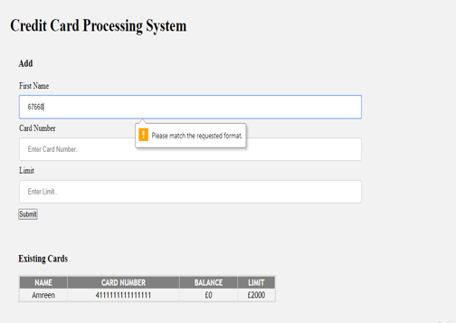
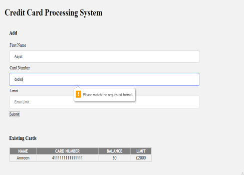
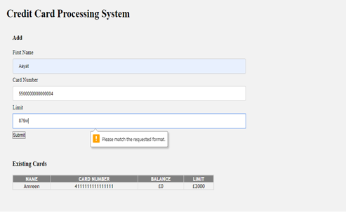
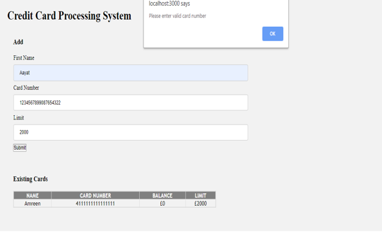
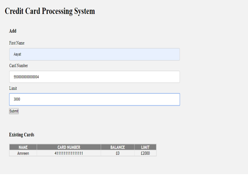
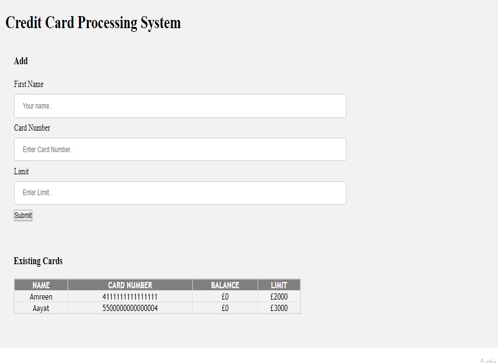

# credit-card-processing-system

## How To Use

### Steps :- 

Clone or Download this repo
Navigate to "credit-card-processing-system" and open the folder in VisualStudioCode

\>run "npm install" to install all dependencies

\>run "npm run build"

\>Now start the server with : node index

\>visit http://localhost:3000/ in the browser

\>Alternatively, you can use node index.js YOUR_PORT_NUMBER to start the server with a specific port.

#### Run Test Steps :-

Run below command:-

\>npm install -save-dev jest

\>npm i -save-dev enzyme

\>npm install

\>npm run test

## Screenshots :-

