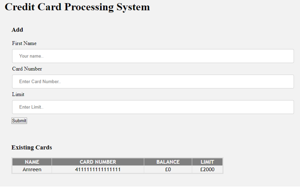

# credit-card-processing-system

## How To Use

### Steps :- 

1. Clone or Download this repo
2. Navigate to "credit-card-processing-system" and open the folder in VisualStudioCode
3. run "npm install" to install all dependencies
4. run "npm run buil" to build
4. run "node index" to run project
5. visit http://localhost:3000/ in the browser

